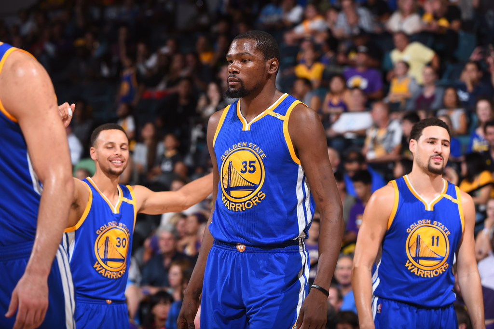
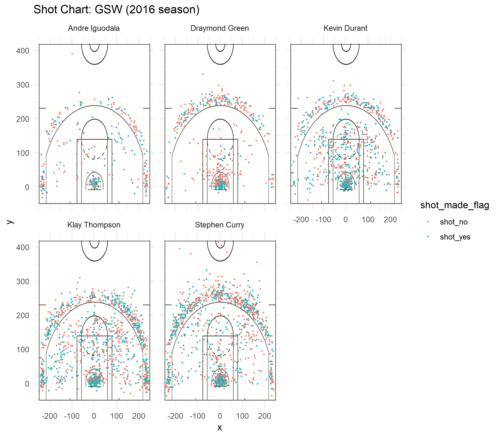

Workout 1
================
Balaji Veeramani

Golden State Warriors: Who is the Best Shooter?
===============================================

 *Image retrieved from [https://www.slamonline.com/](https://www.slamonline.com/nba/stephen-curry-kevin-durant-klay-thompson-combine-78-points/)*

Introduction
------------

The Golden State Warriors is a basketball team based in Oakland, California. In recent years, the team has consistently dominated in the National Basketball Association and produced some of the best basketball players in the world. Stephen Curry, Kevin Durant, Draymond Green, and Andre Iguodala are all-star players on the Warriors. The purpose of the report is to answer the question: who among them is the best shooter?

Motivation
----------

Stephen Curry, Kevin Durant, Draymond Green, and Andre Iguodala are reputed to be the best current players on the Golden States Warriors. There is continual debate on which player is the most valuable player on the team. While there are many factors that contributes to a player's value -- including leadership skills, defensive capabilities, and consistency -- shooting ability is always an important factor. Hence, to advance the discussion on who the best player on the Warriors is, we seek to analyze shot data from five top-performing players and evaluate each player's shooting ability.

Background
----------

Basketball games are played in four quarters. Each quarter is twelve minutes long, and there are five players on each team. There are five canonical basketball positions: point guard, shooting guard, small forward, power forward, and center.

The point guard is responsible for leading plays and creating opportunities for himself and his teammates. The shooting guard is often positioned at the side of the court and shoots from the three-point range. The small forward is a versatile position that has many of the same responsibilities as the shooting guard. The power forward is often positioned close to the basket and is required to guard opposing players from scoring. The center also plays close to the basket and usually collects rebounds and screening opponents.

The table below summarizes describes the position of each player:

| Name           | Position       |
|----------------|----------------|
| Stephen Curry  | Point Gaurd    |
| Kevin Durant   | Power Forward  |
| Andre Iguodala | Small Forward  |
| Klay Thompson  | Shooting Gaurd |
| Draymond Green | Power Forward  |

Data and Analysis
-----------------

*The original data is on shots made by Stephen Curry, Klay Thompson, Kevin Durant, Draymond Green, and Andre Iguodala during the 2016 Golden States Warriors season.*

##### Effecting Three Point Shooting Percentage

``` r
shots_data %>% 
  filter(shot_type == "3PT Field Goal") %>% 
  group_by(name) %>% 
  summarise(
    total = n(), 
    made = sum(shot_made_flag == "shot_yes"), 
    perc_made = made / n()) %>% 
  arrange(desc(perc_made))
```

    ## # A tibble: 5 x 4
    ##   name           total  made perc_made
    ##   <fct>          <int> <int>     <dbl>
    ## 1 Klay Thompson    580   246     0.424
    ## 2 Stephen Curry    687   280     0.408
    ## 3 Kevin Durant     272   105     0.386
    ## 4 Andre Iguodala   161    58     0.360
    ## 5 Draymond Green   232    74     0.319

With 280 three-pointers made, Stephen Curry led the group in three-pointers. His three-point shooting accuracy ranked second at 40.8%, behind only Klay Thompson who achieved 1.6% more. Draymond Green, for contrast, made only 31.9% of three-point attempts. The fact that Curry not only scored the most three-pointers but also maintained a high shooting accuracy lends credence to Curry's shooting ability.

Although Klay Thompson scored 102 fewer points from three-point shots than Stephen Curry, Thompson still maintained the highest shooting accuracy. Hence, Thompson is likely one of the best three-point shooters in the group and is possibly only behind Stephen Curry in ability. Durant, Iguodala, and Green all scored more than 300 points fewer than both Curry and Thompson, suggesting that the former players are less skilled than the latter players at shooting three-point shots.

##### Effective Two Point Shooting Percentage

``` r
shots_data %>% 
  filter(shot_type == "2PT Field Goal") %>% 
  group_by(name) %>% 
  summarise(
    total = n(), 
    made = sum(shot_made_flag == "shot_yes"), 
    perc_made = made / n()) %>% 
  arrange(desc(perc_made))
```

    ## # A tibble: 5 x 4
    ##   name           total  made perc_made
    ##   <fct>          <int> <int>     <dbl>
    ## 1 Andre Iguodala   210   134     0.638
    ## 2 Kevin Durant     643   390     0.607
    ## 3 Stephen Curry    563   304     0.540
    ## 4 Klay Thompson    640   329     0.514
    ## 5 Draymond Green   346   171     0.494

Andre Iguodala led the group in two-point shooting accuracy, but scored the fewest points from two-point shots in the group. Because he scored so few points, his high effective shooting accuracy may carry less weight in the discussion of shooting ability.

Kevin Durant led the group in points scored from two-point shots with 780 points scored. That's 512 points more than the number of points Iguodala scored! Durant ranked second in shooting accuracy, behind the Iguodala by only .031%. The combination of Durant's high two-point accuracy and points scored indicates that Durant is the best player at shooting two-point shots. Although, Klay Thompson and Stephen Curry were close behind Durant in points scored, with 658 points and 608 points scored respectively. So, Curry and Thompson are likely also effective at shooting two-point shots.

##### Overall Effective Shooting Percentage

``` r
shots_data %>% 
  group_by(name) %>% 
  summarise(
    total = n(), 
    made = sum(shot_made_flag == "shot_yes"), 
    perc_made = made / n()) %>% 
  arrange(desc(perc_made))
```

    ## # A tibble: 5 x 4
    ##   name           total  made perc_made
    ##   <fct>          <int> <int>     <dbl>
    ## 1 Kevin Durant     915   495     0.541
    ## 2 Andre Iguodala   371   192     0.518
    ## 3 Klay Thompson   1220   575     0.471
    ## 4 Stephen Curry   1250   584     0.467
    ## 5 Draymond Green   578   245     0.424

Despite Curry's reputation as one of the best shooters in the NBA, Curry ranked second to last in overall shooting accuracy when compared to the other four players. However, Curry led the group in points scored. Compared to Andre Iguodala, who only sored 442 points, Curry scored 1448 points in the 2016 season -- more than 1000 points more than Iguodala! Thompson scored slightly fewer points than Curry but maintained a higher effecting shooting percent. It seems reasonable, then, to claim that Thompson has similar shooting ability to Curry.

##### Shot Charts

 Andre Iguodala and Draymond Green tended to shoot near the basket. In contrast, Kevin Durant, Klay Thompson, and Stephen Curry displayed a variety of shots. The diversity of shots displayed by the players suggest that they are capable of shooting from any location.

``` r
shots_data %>%
  group_by(name) %>%
  summarise(
    average_distance = mean(shot_distance)) %>%
  arrange(desc(average_distance))
```

    ## # A tibble: 5 x 2
    ##   name           average_distance
    ##   <fct>                     <dbl>
    ## 1 Stephen Curry              18.0
    ## 2 Klay Thompson              17.2
    ## 3 Andre Iguodala             13.7
    ## 4 Kevin Durant               13.1
    ## 5 Draymond Green             12.2

Another interesting fact: it turns out that on average, Curry shot the farthest away from the basket. This makes sense because he scored (and attempted) the most three-point shots. Because shooting from a distance is more difficult than shooting close to the basket, Curry's ability to shoot from a distance supports the claim that Curry is one of the best shooters. Note that Klay Thompson shot from a similar distance to Curry on average, so there is evidence that Thompson is also one of the best shooters.

Discussion
----------

From the above analysis, it would appear that Curry is the best three-point shooter, Durant is the best two-point shooter, and either Curry or Thompson is the best overall shooter. Draymond Green consistently ranked lowly in both effective shooting accuracy and points scored, so it is clear than Green is likely not the best shooter among the five players. A question that arises, then, is how good of a shooter is Andre Iguodala? Is he on the level of Durant, Curry, and Thompson, or is he of similar skill to Green? Moreover, who among Durant, Curry, and Thompson is the best?

Let's tackle the first question. The data clearly supports the fact that Iguodala is effective at shooting two-point shots. However, because he ranked poorly at shooting three-point shots, it would be questionable to claim that he is the best shooter in the group since the best shooter should be proficient at shooting both two-point and three-point shots.

On the question of who among Durant, Curry, and Thompson is the best, it would seem that Curry and Thompson are better than Durant, but it is unclear who among Curry and Thompson is better. Although Durant is one of the most accurate shooters on the Golden State Warriors, Durant scored 300 points fewer than both Curry and Thompson overall. Additionally, Durant was less accurate than both Thompson and Curry at shooting three-point shots. These facts support the claim that Durant is a worse shooter than both Curry and Thompson.

From the analysis above, it is clear that Curry and Thompson have similar shooting ability. Curry scored more than Thompson overall, albeit by only 52 points. However, because Thompson outperformed Curry at both three-point and overall effecting shooting accuracy, it seems that Thompson is marginally better than Curry at shooting.

Conclusion
----------

Based on the data provided, Klay Thompson is the best shooter on the Golden State Warriors, although he is only marginally better than Stephen Curry. Kevin Durant is also an excellent shooter, but he isn't quite as good as either Curry or Thompson.

References
----------

-   <http://news.bbc.co.uk/sportacademy/bsp/hi/basketball/rules/players/html/default.stm>
-   <https://www.basketball-reference.com/teams/GSW/2016.html>
